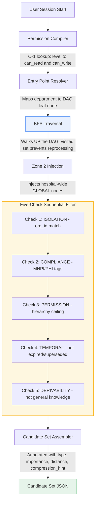

# BRAHMO Rules Engine — BFS + 5-Check Filter Pipeline

Deterministic, zero-LLM permission and relevance filtering for enterprise knowledge graphs. Built for Supra Multi-Specialty Hospital's AI knowledge infrastructure: given a directed acyclic graph of knowledge nodes and a user profile, produce the exact candidate set that user should see — silently, securely, and in under a millisecond once warm.

## Why this exists

Nurse Priya opens an AI session on the Ortho Ward. She should see Supra's Ortho protocols. She must never see Cardiology's experimental trial data, HOD-level admin decisions, expired protocols, or facts the AI already knows from general training. Most enterprise AI tools solve this by showing everything (a security hole) or requiring manual tagging (which nobody maintains). This pipeline solves it structurally: every decision is a deterministic pass/fail check driven entirely by the DAG topology and the user's profile — zero LLM calls, zero manual configuration.

## Architecture

### Data flow
Nurse Priya opens AI session (role: VIEWER, ceiling: Level 10, dept: Ortho Ward)
-> Permission Compiler runs ONCE at session start
Builds O(1) lookup: {level: can_read, can_write} for all 15 levels
-> Entry Point Resolver
Maps Priya's dept to her DAG leaf node (Ortho Ward, Level 10)
-> BFS Traversal walks UP the DAG
Starts at Ortho Ward, walks to Ortho Dept, Clinical Division, Hospital
Multi-parent nodes (e.g. Post-TKR Protocol) processed once via visited set
-> Zone 2 Injection
Hospital-wide GLOBAL nodes (drug safety, emergency codes) injected
regardless of traversal path -- these still pass through all 5 checks
-> Five-Check Sequential Filter (output of check N is input to check N+1)
Check 1 ISOLATION    : org_id = user.org_id
Check 2 COMPLIANCE   : NOT compliance_tags overlapping user.blocked_tags
Check 3 PERMISSION   : hierarchy_level >= user.ceiling_level
Check 4 TEMPORAL     : status != SUPERSEDED, not expired
Check 5 DERIVABILITY : derivability_score < threshold (org-configurable)
-> Candidate Set output: annotated nodes ready for downstream composition

## Why zero LLM

The Rules Engine layer of BRAHMO makes access-control and relevance decisions. An LLM making permission decisions is a security failure — it is probabilistic where the decision must be deterministic. Every check in this pipeline is a binary SQL-expressible condition. Checks 1-4 are exact matches, range comparisons, and array-overlap tests. Check 5 (derivability) uses a pre-computed score set during data seeding, not a runtime model call.

## Tech stack

| Layer | Choice |
|---|---|
| Database | Supabase (PostgreSQL) |
| Backend | FastAPI (Python) |
| Frontend | Next.js + React + Tailwind CSS |
| LLM usage | None, anywhere in this pipeline |

## Project structure
brahmo-rules-engine/
├── backend/
│   ├── main.py
│   ├── db.py                       # cached Supabase accessors (users, hierarchy_levels, knowledge_nodes)
│   ├── pipeline/
│   │   ├── orchestrator.py         # wires all stages together, per-stage timing
│   │   ├── permission_compiler.py
│   │   ├── entry_point_resolver.py
│   │   ├── bfs_traversal.py
│   │   ├── zone2_injector.py
│   │   ├── five_check_filter.py
│   │   └── candidate_assembler.py
│   └── tests/
├── frontend/
│   └── src/
│       ├── app/page.tsx
│       └── components/
│           ├── UserSelector.tsx
│           ├── FilterFunnel.tsx
│           ├── DAGViewer.tsx
│           ├── CandidateTable.tsx
│           └── ComparisonView.tsx
├── supabase/
│   ├── schema.sql
│   └── seed.sql
└── docs/
└── architecture.md

## Performance

All three static tables (`users`, `hierarchy_levels`, `knowledge_nodes`) are cached in-memory per `org_id` / `user_id` on first access, since the seed data is static for the demo session. First request per user pays a one-time Supabase round-trip (roughly 200-1500ms depending on connection state); every subsequent request is served entirely from memory.

| User | Role | Ceiling | First call (cold) | Warm call |
|---|---|---|---|---|
| Nurse Priya | VIEWER | L10 | ~1400ms | <1ms |
| Dr. Vikram | HOD | L4 | ~370ms | <1ms |
| Admin Suresh | ADMIN | L1 | ~420ms | <1ms |

In production this cache would be invalidated on writes (or replaced with Postgres-side materialized views); for this static demo dataset, full in-memory memoization is intentional and disclosed rather than hidden.

## Filtering results (50-node seed graph)

| User | Role | Ceiling | Entry point | After BFS | After Zone2 | Final candidate set |
|---|---|---|---|---|---|---|
| Nurse Priya | VIEWER | L10 | Ortho Ward | 20 | 30 | 13 |
| Dr. Vikram | HOD | L4 | Ortho Dept | 20 | 30 | 21 |
| Admin Suresh | ADMIN | L1 | Hospital Root | 50 | 50 | 42 |

Same graph, same code path, three different candidate sets — driven entirely by user profile data, not per-user branching logic.

## Security model

- **Silent exclusion.** Unauthorized nodes are absent from the response, never flagged as denied. There is no "3 nodes were restricted" message anywhere in this API — that would leak the existence of nodes an unauthorized user shouldn't know about.
- **Sequential checks.** Check 3 cannot run on nodes Check 2 already excluded — a compliance-excluded node never reaches the permission check.
- **Zero LLM in the decision path.** No model is called to decide access; every check is a deterministic comparison.

## API
POST /api/pipeline/run?user_id={id}&include_zone2={true|false}

Returns `pipeline_timing` (per-stage ms + total), `funnel` (node count at each stage), and `candidate_set` (annotated nodes).

## Setup

See `docs/architecture.md` for design rationale, and the SQL files in `supabase/` for schema and seed data. Copy `.env.example` to `.env` with your Supabase project URL and key, then:
pip install -r requirements.txt
python -m uvicorn backend.main:app --port 8000
cd frontend && npm install && npm run dev

## License

Internal assessment project.

